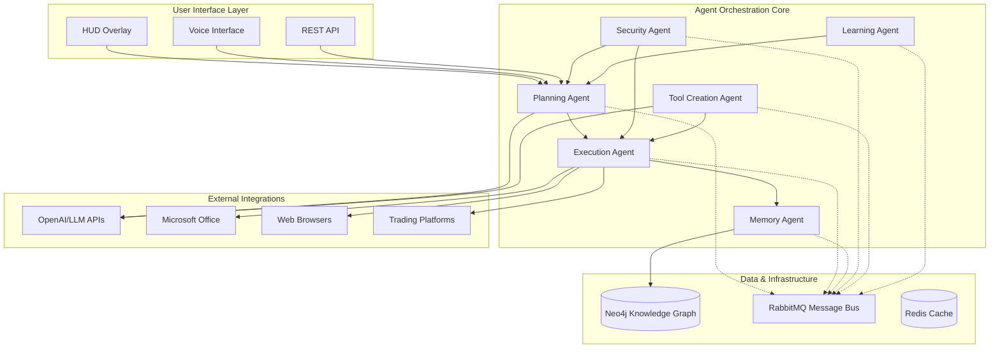

# Archi AI Digital Twin System

<div align="center">

**A self-evolving AI Digital Twin designed to operate as a seamless overlay on Windows desktop environments, providing autonomous assistance through multi-agent orchestration, contextual awareness, and self-improving capabilities.**

[](https://github.com/Dmoore628/PersonalAssistant/actions)
[](https://github.com/psf/black)
[](https://github.com/astral-sh/ruff)
[](https://opensource.org/licenses/MIT)

</div>

## 🎯 Overview

Archi is an advanced AI Digital Twin system that provides:

- **🎤 Always-On Voice Interface** - Sub-20ms wake-word detection with natural language processing
- **🖥️ Computer Use Agent (CUA)** - Universal Windows application control and automation
- **🧠 Multi-Agent Intelligence** - Six specialized AI agents working in orchestration
- **💾 Knowledge Graph Memory** - Role-segmented contextual memory via Neo4j
- **🔧 Dynamic Tool Creation** - Meta-tool generation and autonomous workflow development  
- **🎨 Transparent HUD Overlay** - Real-time information display integrated with Windows
- **🔒 Enterprise-Grade Security** - Comprehensive audit trails and risk assessment
- **📈 Self-Improving Learning** - Human-in-the-loop feedback and continuous adaptation

## 🏗️ Architecture

### Multi-Agent System



### 🤖 Specialized Agents

| Agent | Purpose | Key Features |
|-------|---------|--------------|
| **Planning** | Task decomposition & workflow orchestration | • Intelligent task breakdown<br>• Duration estimation<br>• Risk assessment<br>• Confirmation workflows |
| **Execution** | Computer Use Agent for automation | • Universal app control<br>• Action validation<br>• Safety checks<br>• Emergency stop |
| **Memory** | Knowledge graph & contextual awareness | • Neo4j integration<br>• Semantic search<br>• Relationship mapping<br>• Context retrieval |
| **Security** | Monitoring, audit logging & threat detection | • Real-time monitoring<br>• Risk scoring<br>• Content scanning<br>• Audit trails |
| **Tool Creation** | Dynamic script & automation generation | • Script templates<br>• Safety validation<br>• API integrations<br>• Workflow automation |
| **Learning** | HITL feedback & continuous improvement | • Pattern recognition<br>• Preference adaptation<br>• Predictive modeling<br>• Performance optimization |

## 🚀 Quick Start

### Prerequisites

- **Operating System:** Windows 10 (20H2) or Windows 11
- **Hardware:**
  - CPU: Intel i7-10th gen or AMD Ryzen 7 3700X equivalent
  - RAM: 32GB DDR4 minimum (64GB recommended)
  - GPU: NVIDIA RTX 3070 or equivalent (8GB VRAM minimum)
  - Storage: 1TB NVMe SSD
- **Software:**
  - Docker Desktop
  - Python 3.11+
  - Git

### Installation

1. **Clone the repository:**
   ```powershell
   git clone https://github.com/Dmoore628/PersonalAssistant.git
   cd PersonalAssistant
   ```

2. **Set up environment:**
   ```powershell
   # Copy environment template
   Copy-Item .env.example .env
   
   # Edit .env with your API keys and preferences
   notepad .env
   ```

3. **Install dependencies:**
   ```powershell
   # Install Python dependencies
   pip install -e libs/archi_core
   pip install -r requirements.txt
   
   # Start infrastructure services
   .\scripts\up.ps1 -Build
   ```

4. **Verify installation:**
   ```powershell
   # Run health checks
   .\scripts\test.ps1
   
   # Check service status
   docker-compose -f infra/docker-compose.yml ps
   ```

### Configuration

Edit your `.env` file to configure:

- **AI Services:** OpenAI, Anthropic, Azure OpenAI API keys
- **Voice Processing:** Wake-word sensitivity, speech providers
- **Security:** Risk tolerance levels, confirmation requirements
- **Performance:** Resource limits, caching settings

See [`.env.example`](.env.example) for all available options.

## 🛠️ Development

### Project Structure

```
PersonalAssistant/
├── services/                 # Microservices (6 AI agents)
│   ├── planning_agent/      # Task planning & decomposition  
│   ├── execution_agent/     # Computer Use Agent
│   ├── memory_agent/        # Knowledge graph management
│   ├── security_agent/      # Security & audit logging
│   ├── tool_creation_agent/ # Dynamic tool generation
│   └── learning_agent/      # HITL learning & adaptation
├── libs/                    # Shared libraries
│   └── archi_core/         # Core schemas, config, messaging
├── infra/                   # Infrastructure & deployment
│   ├── docker-compose.yml  # Service orchestration
│   └── docker-compose.override.yml  # Development overrides
├── scripts/                 # PowerShell automation scripts
├── tests/                   # Test suites
├── docs/                    # Documentation
│   ├── adr/                # Architecture Decision Records
│   └── validation/         # Validation logs & protocols
└── .github/                 # CI/CD & templates
```

### Development Workflow

1. **Create feature branch:**
   ```bash
   git checkout -b feature/voice-processing/wake-word-detection
   ```

2. **Make changes and test:**
   ```powershell
   # Lint and format
   .\scripts\lint.ps1
   
   # Run tests
   .\scripts\test.ps1
   
   # Test locally
   .\scripts\up.ps1
   ```

3. **Submit pull request:**
   - Follow conventional commit format
   - Include validation log in `docs/validation/logs/`
   - Ensure all checks pass

### Code Quality

- **Formatting:** Black (line length: 100)
- **Linting:** Ruff with comprehensive rule set
- **Type Checking:** MyPy (gradual typing)
- **Testing:** Pytest with 70%+ coverage target
- **Documentation:** Docstrings, ADRs, validation logs

### Testing

```powershell
# Run all tests
pytest

# Run with coverage
pytest --cov=libs --cov=services --cov-report=html

# Run integration tests
docker-compose -f infra/docker-compose.yml up -d
pytest tests/integration/

# Run specific agent tests  
pytest tests/test_planning_agent.py -v
```

## 📚 Documentation

### Core Documentation
- [Technical Requirements Document](archi-technicalrequirement.md) - Complete system specifications
- [Implementation Roadmap](ImplementationRoadmap.md) - Development phases and milestones
- [Architecture Decision Records](docs/adr/) - Design decisions and rationale

### API Documentation
Each agent exposes REST APIs documented with OpenAPI/Swagger:
- Planning Agent: `http://localhost:8011/docs`
- Execution Agent: `http://localhost:8012/docs`
- Memory Agent: `http://localhost:8013/docs`
- Security Agent: `http://localhost:8014/docs`
- Tool Creation Agent: `http://localhost:8015/docs`
- Learning Agent: `http://localhost:8016/docs`

### Integration Guides
- [Voice Processing Setup](docs/voice-processing.md)
- [Computer Use Agent Configuration](docs/cua-setup.md)
- [Knowledge Graph Schema](docs/knowledge-graph.md)
- [Security Configuration](docs/security-setup.md)

## 🔒 Security

Archi implements comprehensive security measures:

- **🔐 Encryption:** AES-256 for data at rest, TLS 1.3 for transport
- **🛡️ Access Control:** Role-based permissions with audit trails
- **🔍 Monitoring:** Real-time threat detection and risk assessment
- **🚨 Safe Execution:** Action validation and confirmation workflows
- **📋 Compliance:** SOC 2 Type II standards for financial data

### Security Features

- Zero-knowledge architecture for cloud LLM interactions
- Windows Credential Manager integration for secrets
- Tamper-proof audit logging with risk scoring
- Content scanning for sensitive information
- Multi-level confirmation for high-risk operations

Report security issues via [GitHub Security Advisories](https://github.com/Dmoore628/PersonalAssistant/security/advisories).

## 🤝 Contributing

We welcome contributions! Please see our [Contributing Guide](CONTRIBUTING.md) for details.

### Ways to Contribute
- 🐛 **Bug Reports:** Use [bug report template](.github/ISSUE_TEMPLATE/bug_report.md)
- ✨ **Feature Requests:** Use [feature request template](.github/ISSUE_TEMPLATE/feature_request.md)
- 🤖 **Agent Enhancements:** Use [agent enhancement template](.github/ISSUE_TEMPLATE/agent_enhancement.md)
- 🔗 **Integrations:** Use [integration request template](.github/ISSUE_TEMPLATE/integration_request.md)
- ⚡ **Performance:** Use [performance issue template](.github/ISSUE_TEMPLATE/performance_issue.md)

### Development Guidelines
- Follow conventional commit format: `feat(scope): description`
- Maintain test coverage above 70%
- Update documentation for API changes
- Include validation logs for significant changes

## 📄 License

This project is licensed under the MIT License - see the [LICENSE](LICENSE) file for details.

## 🙏 Acknowledgments

- **OpenAI & Anthropic** - Advanced language model capabilities
- **Neo4j** - Graph database technology for knowledge representation
- **FastAPI** - High-performance API framework
- **Docker** - Containerization and orchestration
- **Microsoft** - Windows platform integration capabilities

---

<div align="center">

**Built with ❤️ for autonomous productivity and intelligent assistance**

[📖 Documentation](docs/) • [🐛 Issues](https://github.com/Dmoore628/PersonalAssistant/issues) • [💬 Discussions](https://github.com/Dmoore628/PersonalAssistant/discussions)

</div>
